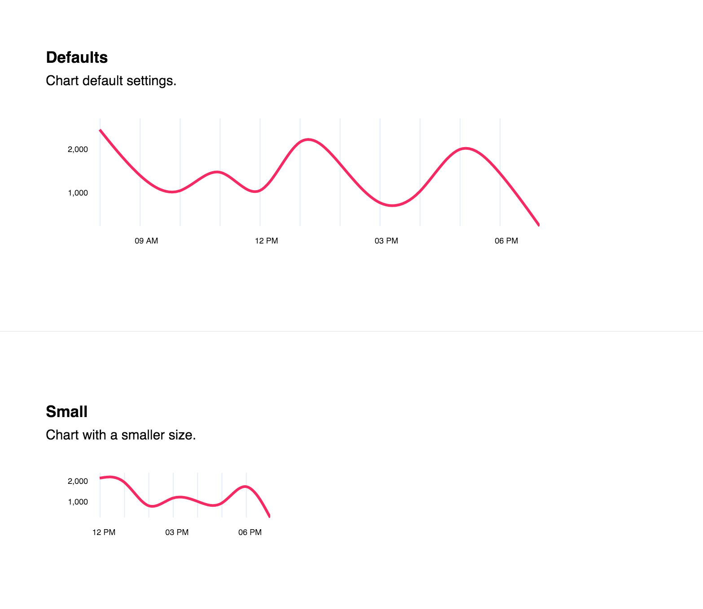

# D3 line.

 D3 line graph. See source for examples and documentation.

## Installation

```
$ npm install d3-line
```

## Usage



## Developing

Build:

```
$ make build
```

Start dev server:

```
$ make start
```


